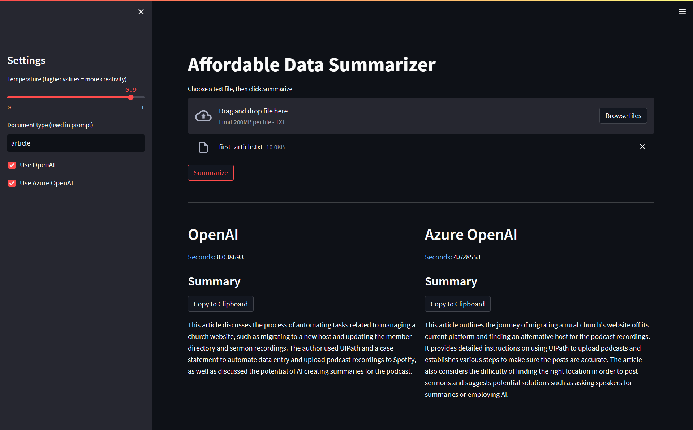

# Affordable Data Summarizer

This demo app was made to support a post on my Affordable Data Substack. Check out the post for background.

There are a lot of example apps for summarizing text, and some of them use Streamlit like this one. But I didn't find any others that allowed the user to compare summaries from multiple AI providers.



## Installation
1. Create an [OpenAI API Key](https://platform.openai.com/account/api-keys)

2. Create an Azure OpenAI resource and get the API Key: 
[How-to - Create a resource and deploy a model using Azure OpenAI Service](https://learn.microsoft.com/azure/cognitive-services/openai/how-to/create-resource?pivots=web-portal)

3. Clone the project repo:

```git clone https://github.com/AffordableData/Summarizer```

4. Rename the file `.env-sample` to `.env`

```mv .env-sample .env```

5. Update the values in the `.env` file with the information from steps 1 and 2 above.

6. Install the requirements:

```pip install -r requirements.txt```

7. Start the application:

```streamlit run app.py```

8. Open the website, which is usually https://localhost:8501 if you haven’t run Streamlit apps before.